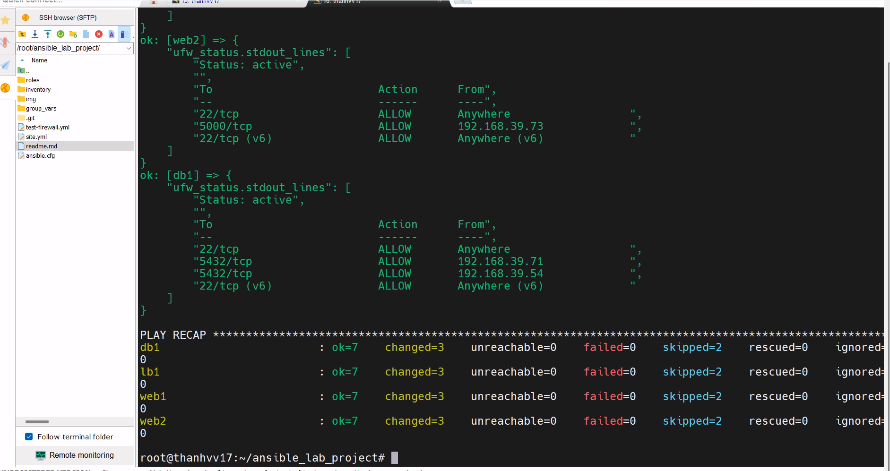

# Sơ đồ kiến trúc: Ansible Multi-VM Docker Web Stack

## Thông tin IP các VM

| VM | Vai trò | IP | Group Ansible |
|---|---|---|---|
| VM1 | Load Balancer (Nginx - native) | 192.168.39.73 | loadbalancer |
| VM2 | Web App backend #1 (Docker) | 192.168.39.71 | webservers |
| VM3 | Web App backend #2 (Docker) | 192.168.39.54 | webservers |
| VM4 | Database (Docker - Postgres) | 192.168.39.15 | dbservers |

## Chú thích luồng dữ liệu

1. **User → VM1 (Nginx)**: request HTTP vào port 80, nginx nhận và đóng vai trò reverse proxy
2. **VM1 → VM2/VM3**: nginx dùng `upstream` block (render động qua Jinja2, loop qua `groups['webservers']`) để load-balance round-robin sang 2 container webapp qua port 5000
3. **VM2/VM3 → VM4**: mỗi container webapp đọc biến `DB_HOST=192.168.39.15` (lấy động qua `hostvars[groups['dbservers'][0]].ansible_host`, không hardcode) để kết nối Postgres qua port 5432
4. **Firewall trên VM4**: chỉ whitelist đúng 2 IP `192.168.39.71` và `192.168.39.54` được phép vào port 5432 — chặn mọi nguồn khác kể cả VM1
5. **Control node**: kết nối SSH riêng biệt tới cả 4 VM để chạy Ansible playbook — đây là kênh quản trị, tách biệt hoàn toàn với luồng traffic ứng dụng thật (đường nét đứt trong sơ đồ)

## Bước 1 : Cấu hình firewall 
- Viểt playbook testfirewall 


## Bước 2 : Cài đặt firewall trên các VM 
- Viết file site.yml cập nhật thêm các role docker , firewall , 
- Dùng tag docker để chạy mỗi docker 
```
roles/docker/
└── tasks/
    └── main.yml
```
```
ansible-playbook site.yml --tags docker
```
## Bước 3 : Cấu hình database 
Cấu trúc thư mục database trong ansible 
```
roles/database/
├── tasks/
│   └── main.yml
└── templates/
    └── db_env.j2
```